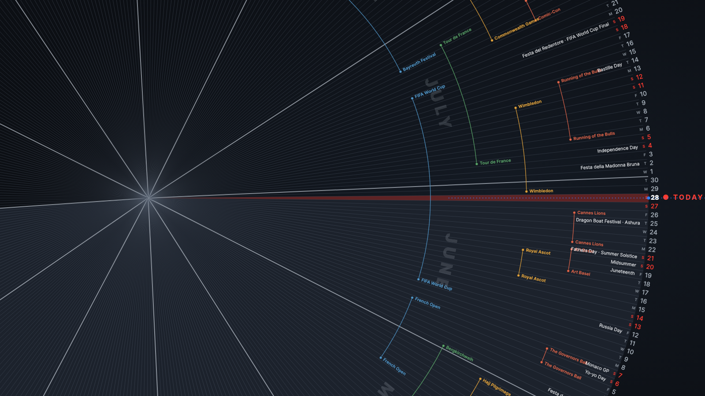

# Radial Calendar

An interactive annual calendar rendered as a spinning ring. Each day of the year
is a radial line ("spoke"); the day number sits at the tip and holidays/events
radiate outward from it. Month boundaries are drawn as thicker lines, and
multi-day events are shown as concentric sunburst arcs. A fixed red horizontal
line marks **today** — the wheel loads aligned to today and you can spin it
back and forth to explore the rest of the year.



## Run

It's a static site (vanilla JS + SVG, no build step). Because it fetches the CSV,
serve it over HTTP rather than opening the file directly:

```bash
cd "Radial Calendar"
python3 -m http.server 8753
# then open http://localhost:8753
```

Any static server works (e.g. `npx serve`).

## Controls

- **Drag** the wheel to spin it.
- **Scroll / trackpad** to move through days.
- **← / →** (or **↑ / ↓**) step one day at a time.
- **T** or the **Today** button jumps back to today.
- **Load CSV…** loads a different year's data (filename containing `20xx` sets the year).

## Data format

The app reads `data/calendar-2026.csv`. Columns:

| Column | Meaning |
| --- | --- |
| `Month`, `Date`, `Day` | Month name, day-of-month, weekday initial |
| `Holiday` | One or more holidays for that day (separate multiple with `/`) |
| `RangeRing_A` … `RangeRing_E` | Name of a multi-day event in track A–E (placed at the start/end of the span) |
| `RangeLine_A` … `RangeLine_E` | `X` on every day the event in that track spans |

Each of the five tracks (A–E) is a concentric ring, letting overlapping
multi-day events stack without colliding. Consecutive `X` marks form one event;
the parser splits a run into two events if the name changes mid-run (e.g. Cannes
Film Festival → French Open share a track).

## Project layout

```
index.html        markup + HUD
styles.css        styling / theme
src/parse.js      CSV parsing -> calendar model
src/radial.js     SVG renderer + spin interaction
src/main.js       bootstrap + UI wiring
data/             CSV data
```
